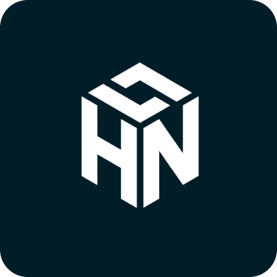

[](https://github.com/zepfietje/starware)

<!-- ALL-CONTRIBUTORS-BADGE:START - Do not remove or modify this section -->
[](#contributors-)
<!-- ALL-CONTRIBUTORS-BADGE:END -->

[![Contributors][contributors-shield]][contributors-url]
[![Forks][forks-shield]][forks-url]
[![Stargazers][stars-shield]][stars-url]
[![Issues][issues-shield]][issues-url]
[![MIT License][license-shield]][license-url]

<br />
<p align="center">
  <a href="https://github.com/dscnitrourkela/project-oregano">
    
  </a>

  <h3 align="center">HackNITR 3.0</h3>

  <p align="center">
    The official repository for the website of HackNITR 3.0
    <br />
    <br />
    <a href="https://dev.hacknitr.tech">View Live</a>
    ·
    <a href="https://github.com/dscnitrourkela/project-oregano/issues">Report Bugs</a>
    .
    <a href="https://github.com/dscnitrourkela/project-oregano/issues">Add Features</a>
  </p>
</p>

<!-- TABLE OF CONTENTS -->
<details open="open">
  <summary>Table of Contents</summary>
  <ol>
    <li>
      <a href="#about-the-project">About The Project</a>
      <ul>
      </ul>
        <li><a href="#built-with">Built With</a></li>
    </li>
    <li>
      <a href="#getting-started">Getting Started</a>
      <ul>
        <li><a href="#prerequisites">Prerequisites</a></li>
        <li><a href="#contribution-guidlines">Contribution guidlines</a></li>
        <li><a href="#local-repository-setup">Local Repository Setup</a></li>
        <li><a href="#running-the-project">Running the project</a></li>
      </ul>
    </li>
    <li><a href="#license">License</a></li>
    <li><a href="#dsc-nit-rourkela">DSC NIT Rourkela</a></li>
    <li><a href="#starware">Starware</a></li>
    <li><a href="#contributors">Contributors</a></li>
  </ol>
</details>

## About The Project

HackNITR, one of the largest hackathons in India's eastern region, is a kind of hackathon that endeavours to bring and integrate talent, innovation, and creativity under one roof to build solutions for real-world problems using the latest technologies. It is organized by a bunch of tech enthusiasts from Developer Student Clubs (DSC) NIT Rourkela in collaboration with OpenCode, Opensource community, registered under the technical society of Student Activity Centre (SAC), NIT Rourkela.

## Built With

Following technologies and libraries are used for the development of this website

- [React]()
- [Gatsby]()
- [Tailwind]()
- [Cloudflare]()
- [Netlify]()

## Getting Started

To setup the project locally the steps below.

### Prerequisites

- [Node.js](https://nodejs.org/en/download/)

  ```sh
  # Homebrew
  brew install nodejs

  # Sudo apt
  sudo apt install nodejs

  # Packman
  pacman -S nodejs

  # Module Install
  dnf module install nodejs:<stream> # stream is the version

  # Windows (chocolaty)
  cinst nodejs.install

  ```

- [Yarn](https://classic.yarnpkg.com/en/docs/install/)

```sh
  npm install --global yarn
```

- [Git](https://git-scm.com/downloads)

```sh
  # Homebrew
  brew install git

  # Sudo apt
  apt-get install git

  # Packman
  pacman -S git

  # Module Install (Fedora)
  dnf install git

```

### Contribution guidlines 🎃

---

Our Slack Community: [Slack Invite](http://bit.ly/NITRDevs) <br>

`Contributions are welcome 🎉🎉`

### Local Repository Setup

Please refer to the project's style and contribution guidelines for submitting patches and additions. In general, we follow the "fork-and-pull" Git workflow.

1.  **Fork** the repo on GitHub
2.  **Clone** the project to your local system
3.  **Commit** changes to your own separate branch
4.  **Push** your work back up to your fork
5.  Submit a **Pull request** so that we can review your changes

NOTE 1: Please abide by the [Contributing Guidelines](https://github.com/dscnitrourkela/project-guava-web/blob/master/CONTRIBUTING.md).

NOTE 2: Please abide by the [Code of Conduct](https://github.com/dscnitrourkela/project-guava-web/blob/master/CODE_OF_CONDUCT.md).

### Running the project.

The project uses Yarn and not NPM. It is strictly advised to stick with Yarn so as to avoid dependency conflicts down the line.

```
## Checkout into the project client directory
cd client

## Install Dependencies
yarn install

## Run the Project
yarn develop

```

Following are the commands to remove/add new dependencies using yarn

```
## Add a new Package
yarn add package_name

## Remove an existing Package
yarn remove package_name

## Save Package as a Dev Dependency
yarn add -D package_name
```

## License

Distributed under the MIT License. See `LICENSE` for more information.

## DSC NIT Rourkela

[![DSC NIT Rourkela][dsc-nitrourkela]](https://dscnitrourkela.org)

## Starware

dscnitrourkela/project-guava is Starware.
This means you're free to use the project, as long as you star its GitHub repository.
Your appreciation makes us grow and glow up. ⭐

## Contributors ✨

Thanks goes to these wonderful people ([emoji key](https://allcontributors.org/docs/en/emoji-key)):

<!-- ALL-CONTRIBUTORS-LIST:START - Do not remove or modify this section -->
<!-- prettier-ignore-start -->
<!-- markdownlint-disable -->
<table>
  <tr>
    <td align="center"><a href="http://dscnitrourkela.org"><br /><sub><b>DSC NIT Rourkela</b></sub></a><br /><a href="#projectManagement-dscnitrourkela" title="Project Management">📆</a></td>
    <td align="center"><a href="https://abhibhaw.co"><br /><sub><b>Abhibhaw Asthana</b></sub></a><br /><a href="https://github.com/dscnitrourkela/project-oregano/pulls?q=is%3Apr+reviewed-by%3Aabhibhaw" title="Reviewed Pull Requests">👀</a></td>
    <td align="center"><a href="https://github.com/CIPHERTron"><br /><sub><b>Pritish Samal</b></sub></a><br /><a href="https://github.com/dscnitrourkela/project-oregano/commits?author=CIPHERTron" title="Code">💻</a> <a href="#maintenance-CIPHERTron" title="Maintenance">🚧</a> <a href="#mentoring-CIPHERTron" title="Mentoring">🧑‍🏫</a> <a href="https://github.com/dscnitrourkela/project-oregano/pulls?q=is%3Apr+reviewed-by%3ACIPHERTron" title="Reviewed Pull Requests">👀</a> <a href="#projectManagement-CIPHERTron" title="Project Management">📆</a></td>
    <td align="center"><a href="http://riteshpatil.dev"><br /><sub><b>Ritesh Patil</b></sub></a><br /><a href="https://github.com/dscnitrourkela/project-oregano/commits?author=riteshsp2000" title="Code">💻</a> <a href="https://github.com/dscnitrourkela/project-oregano/commits?author=riteshsp2000" title="Documentation">📖</a> <a href="#ideas-riteshsp2000" title="Ideas, Planning, & Feedback">🤔</a> <a href="#projectManagement-riteshsp2000" title="Project Management">📆</a> <a href="#maintenance-riteshsp2000" title="Maintenance">🚧</a></td>
    <td align="center"><a href="https://github.com/DesignrKnight"><br /><sub><b>Abel Mathew</b></sub></a><br /><a href="https://github.com/dscnitrourkela/project-oregano/commits?author=DesignrKnight" title="Code">💻</a> <a href="#security-DesignrKnight" title="Security">🛡️</a> <a href="#infra-DesignrKnight" title="Infrastructure (Hosting, Build-Tools, etc)">🚇</a></td>
    <td align="center"><a href="https://github.com/padmajabhol"><br /><sub><b>Padmaja Bhol</b></sub></a><br /><a href="https://github.com/dscnitrourkela/project-oregano/commits?author=padmajabhol" title="Code">💻</a></td>
    <td align="center"><a href="https://www.linkedin.com/in/ratnakar-sahoo-a78401135"><br /><sub><b>Ratnakar Sahoo</b></sub></a><br /><a href="https://github.com/dscnitrourkela/project-oregano/commits?author=ratnakar5938" title="Code">💻</a></td>
  </tr>
  <tr>
    <td align="center"><a href="https://irsayvid.azurewebsites.net/"><br /><sub><b>Divya Sri Darimisetti</b></sub></a><br /><a href="https://github.com/dscnitrourkela/project-oregano/commits?author=irsayvid" title="Code">💻</a></td>
    <td align="center"><a href="https://github.com/sambit-sankalp"><br /><sub><b>sambit-sankalp</b></sub></a><br /><a href="https://github.com/dscnitrourkela/project-oregano/commits?author=sambit-sankalp" title="Code">💻</a></td>
    <td align="center"><a href="https://github.com/Sonakshi1901"><br /><sub><b>Sonakshi Satpathy</b></sub></a><br /><a href="https://github.com/dscnitrourkela/project-oregano/commits?author=Sonakshi1901" title="Code">💻</a></td>
    <td align="center"><a href="https://github.com/nayakastha"><br /><sub><b>Astha Nayak</b></sub></a><br /><a href="#maintenance-nayakastha" title="Maintenance">🚧</a> <a href="https://github.com/dscnitrourkela/project-oregano/commits?author=nayakastha" title="Code">💻</a> <a href="https://github.com/dscnitrourkela/project-oregano/commits?author=nayakastha" title="Documentation">📖</a> <a href="#mentoring-nayakastha" title="Mentoring">🧑‍🏫</a> <a href="#eventOrganizing-nayakastha" title="Event Organizing">📋</a> <a href="https://github.com/dscnitrourkela/project-oregano/pulls?q=is%3Apr+reviewed-by%3Anayakastha" title="Reviewed Pull Requests">👀</a> <a href="#projectManagement-nayakastha" title="Project Management">📆</a></td>
  </tr>
</table>

<!-- markdownlint-restore -->
<!-- prettier-ignore-end -->

<!-- ALL-CONTRIBUTORS-LIST:END -->

This project follows the [all-contributors](https://github.com/all-contributors/all-contributors) specification. Contributions of any kind welcome!

<!-- MARKDOWN LINKS & IMAGES -->
<!-- https://www.markdownguide.org/basic-syntax/#reference-style-links -->

[contributors-shield]: https://img.shields.io/github/contributors/dscnitrourkela/project-oregano?style=for-the-badge
[contributors-url]: https://github.com/dscnitrourkela/project-oregano/graphs/contributors
[forks-shield]: https://img.shields.io/github/forks/dscnitrourkela/project-oregano?style=for-the-badge
[forks-url]: https://github.com/dscnitrourkela/project-oregano/network/members
[stars-shield]: https://img.shields.io/github/stars/dscnitrourkela/project-oregano?style=for-the-badge
[stars-url]: https://github.com/dscnitrourkela/project-oregano/stargazers
[issues-shield]: https://img.shields.io/github/issues/dscnitrourkela/project-oregano?style=for-the-badge
[issues-url]: https://github.com/dscnitrourkela/project-oregano/issues
[license-shield]: https://img.shields.io/github/license/dscnitrourkela/project-oregano=for-the-badge
[license-url]: LICENSE
[product-screenshot]: images/Compose.png
[dsc-nitrourkela]: images/repoCover.png
